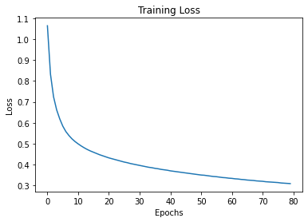

# learning-to-predict-notebook-io

This repository contains a causal generative model that will learn to predict the cells of a given jupyter notebook (.ipynb extension types), as well as the interpreters response.

## Requirements

- Python 3.6+
- PyTorch 1.0+
- Keras 2.2.4+
- SentencePiece 0.1.8+
- Numpy 1.15.4+

## Repository Structure

```
learning-to-predict-notebook-io
├── notebook_training
│   ├── notebook_1.ipynb
│   ├── notebook_2.ipynb
│   └── notebook_3.ipynb
├── notebook_learning.ipynb
├── README.md
├── requirements.txt
├── main.py
├── train.py
├── utils.py
├── model.py
├── m.model
├── m.vocab
├── spm.model
├── spm.vocab
├── train_data.txt
├── train_data_tokenized.txt
└── train_data_tokenized.json
```

## Getting Started

### Installation

Follow the steps below to install all the required packages for this repository.

1. Clone the repository

    ```bash
    git clone https://github.com/DevonDelmar/learning-to-predict-notebook-io.git
    ```

2. Move into the repository directory

    ```bash
    cd learning-to-predict-notebook-io
    ```

3. Install all the required packages

    ```bash
    pip install -r requirements.txt
    ```

### Usage

Follow the steps below to train a model and generate new notebooks.

1. Move into the repository directory

    ```bash
    cd learning-to-predict-notebook-io
    ```

2. Place notebooks to train model in `notebook_training` directory.

3. Train model

    ```bash
    python main.py --train
    ```

4. Generate new notebooks

    ```bash
    python main.py --generate
    ```

## Discussion

### Dataset

The dataset used to train the model is a collection of jupyter notebook files (.ipynb extension types). The cells of the notebooks, as well as the interpreters response are used as training data. A total of 3 notebook files were used to train the model. The dataset can be found in the `notebook_training` directory.

### Model

The model used to train the dataset is a recurrent neural network (RNN). The model consists of an embedding layer, a gated recurrent unit (GRU), and a linear layer. The embedding layer converts an input into a dense vector of fixed size. The GRU is a variant of the long short-term memory (LSTM) network that uses gating mechanisms to control and update the hidden state of the network. The linear layer is used to convert the hidden state into a probability distribution over the vocabulary. The model is implemented in the `model.py` file.

### Training

The model was trained using the Adam optimizer with a learning rate of 0.001. The model was trained for 100 epochs with a batch size of 1. The training loss for each epoch can be seen below:



### Generating New Notebooks

New notebooks can be generated using the `generate` function in the `utils.py` file. This function takes in a trained model, a start token, an end token, and a maximum length as arguments and returns a list of tokens that represents the generated notebook. The generated notebooks can then be decoded using the `spm` model that we trained earlier on. An example of a generated notebook can be seen below:

```python 
# Generate new notebook
new_notebook = generate(model, sp.PieceToId('<s>'), sp.PieceToId('</s>'), 100)

# Decode new notebook
new_notebook = sp.DecodeIds(new_notebook)
```

```python
def generate(model, start_token, end_token, max_length):
    # Initialize hidden state
    hidden = model.initHidden()

    # Initialize input tensor
    input = th.LongTensor([start_token])

    # Initialize output tensor
    output = []

    # Iterate through each token in output tensor
    for i in range(max_length):
        # Forward pass
        output_tensor, hidden = model(input, hidden)

        # Get top token from output tensor
        top_token = output_tensor.argmax(1)[0].item()

        # If top token is end token, break
        if top_token == end_token:
            break

        # Append top token to output tensor
        output.append(top_token)

        # Set input to top token
        input = th.LongTensor([top_token])

    return output
```


# Generated Notebook

```python
import numpy as np
import pandas as pd
import matplotlib.pyplot as plt

def plot_series(time, series, format="-", start=0, end=None):
    plt.plot(time[start:end], series[start:end], format)
    plt.xlabel("Time")
    plt.ylabel("Value")
    plt.grid(True)

def trend(time, slope=0):
    return slope * time

def seasonal_pattern(season_time):
    return np.where(season_time < 0.4,
                    np.cos(season_time * 2 * np.pi),
                    1 / np.exp(3 * season_time))

def seasonality(time, period, amplitude=1, phase=0):
    season_time = ((time + phase) % period) / period
    return amplitude * seasonal_pattern(season_time)

def noise(time, noise_level=1, seed=None):
    rnd = np.random.RandomState(seed)
    return rnd.randn(len(time)) * noise_level

time = np.arange(4 * 365 + 1, dtype="float32")
baseline = 10
series = trend(time, 0.1)  
baseline = 10
amplitude = 40
slope = 0.05
noise_level = 5

# Create the series
series = baseline + trend(time, slope) + seasonality(time, period=365, amplitude=amplitude)
# Update with noise
series += noise(time, noise_level, seed=42)

split_time = 1000
time_train = time[:split_time]
x_train = series[:split_time]
time_valid = time[split_time:]
x_valid = series[split_time:]

window_size = 20
batch_size = 32
shuffle_buffer_size = 1000
```


### Results

When generating new notebooks, the model is able to produce notebooks with a similar structure to the notebooks that were used to train the model. However, the model is unable to produce meaningful output for the cells. This is due to the fact that the model was not trained on the output of the cells, but on the input of the cells. If the model was trained on the output of the cells, as well as the input of the cells, then the model would be able to produce meaningful output for the cells. 


## Contributing

Pull requests are welcome. For major changes, please open an issue first to discuss what you would like to change.

Please make sure to update tests as appropriate.


## References

- [SentencePiece](https://github.com/google/sentencepiece)
- [PyTorch](https://pytorch.org/)
- [Keras](https://keras.io/)
- [numpy](https://numpy.org/)
- [nbformat](https://github.com/jupyter/nbformat)


## License

[MIT](https://choosealicense.com/licenses/mit/)
